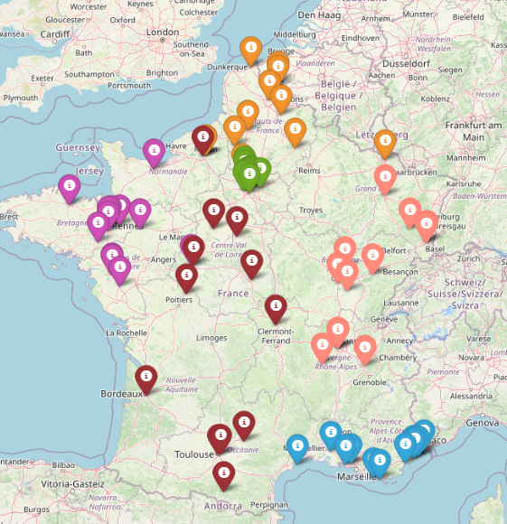

# Volleyball-Pools-Optimization

This project has been made in order to try to optimize the organization of volley ball pools in France N3 level, with 72 cities in 6 pools.
To do it, I used a genetic algorithm to solve the problem, with permutations between cities to mutate the population of chromosomes. 
The algorithm performed well according to the fitness function used, but some improvements can still be made ! 

The Nominatim package was used to get the GPS location of the cities, and the results were plotted on a map with Folium.

Here is the result of the algorithm :

